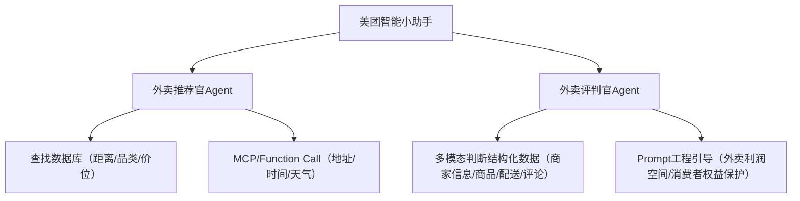

# meituan_agents
我是看到美团外卖有清汤大老爷，美团外卖平台的"美团评审"功能，网友通过投票机制扮演类似古代"青天大老爷"的角色，对争议订单进行"赛博判案"。

我在网上看到很多视频以及清汤大老爷的梗，这里面的弯绕笑点实在太多，我就开始思考，AI能不能做这个事情。我在想大模型能不能看懂外卖仲裁的冲突点和笑点。
然后我就在想这不就是做AI大模型应用很好的项目吗？然后我就打算做个清汤大老奶，以及希望你吃好饭的老奶哈哈哈。利用这个项目学习AI应用包圆学习一遍，有点强蹭哈，抱意思！

画一个美团智能版小助手整个思路的图。

